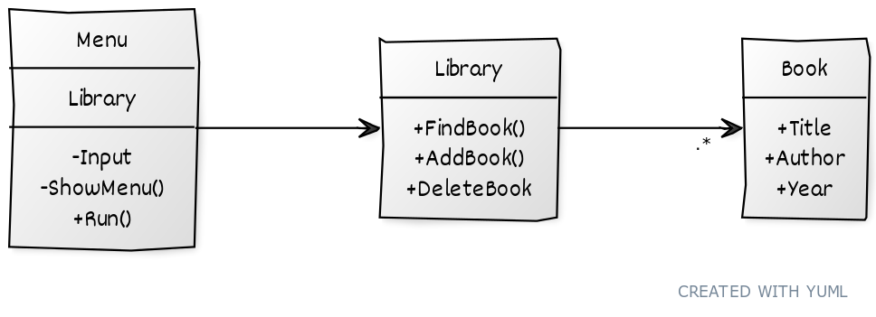

# My Demo

Jag valde att skapa tre klasser

- Library som hanterar böcker
- Book som är en specifik bok mall
- Menu som hanterar kommunikation med Library

## Library klassen

Den använder List<Book> för att hålla koll på böckerna.

Jag valde att använda List för att....

## Bok klassen

Den hae tre egenskaper
- Författare
- Titel
- Årtal

